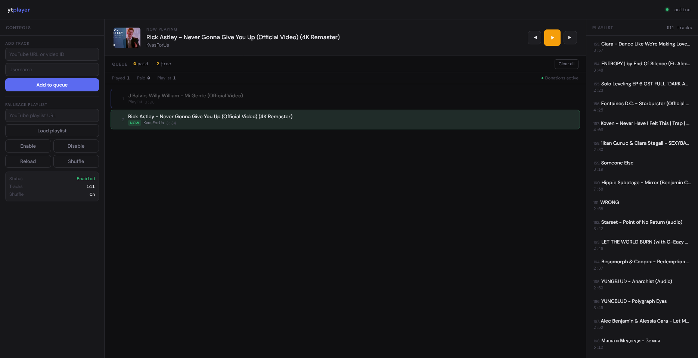
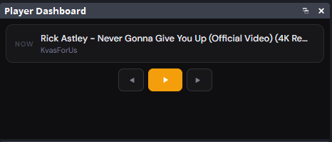

# Документация YouTube Player

Это приложение было написано для себя и поначалу представляло маленький скрипт из трёх сотен строк, поэтому его публикация не предполагалась. Сейчас же проделано много труда для того, чтобы оно стало более удобным и функциональным, и я хочу надёжно его сохранить.

## Что это

Программа для воспроизведения YouTube видео по очереди на стриме, standalone-альтернатива таким сервисам, как Trula Music. Позволяет зрителям добавлять музыкальные клипы в очередь, есть поддержка донатов через Donatty, можно загрузить плейлист. Встроенный веб-интерфейс для управления и оверлей для вставки в OBS.

**Важно:** Программа работает только с *музыкальными* видео YouTube. Другие категории воспроизводиться не будут.

## Быстрый старт

### Минимальная настройка

Для запуска программы **обязательно** нужны только два параметра:

1. **port** - порт для веб-интерфейса
2. **youtube_api_key** - ключ YouTube API

Если какие-то параметры вам не нужны, можно просто удалить эти строки.

Минимальный `config.json`:

```json
{
  "port": 8093,
  "youtube_api_key": "ВАШ_КЛЮЧ_YOUTUBE_API"
}
```

С такой конфигурацией программа запустится, но:

- Не будет ограничений на длину видео и количество просмотров
- Музыка за донаты работать не будет
- Плейлист по умолчанию не загрузится
- Очередь может быть сколь угодно большой

### Рекомендуемая настройка

Для нормальной работы лучше указать базовые ограничения:

```json
{
  "port": 8093,
  "max_duration_minutes": 9,
  "min_views": 1000,
  "max_queue_size": 100,
  "youtube_api_key": "ВАШ_КЛЮЧ_YOUTUBE_API"
}
```

### Полная настройка

Пример со всеми возможными параметрами:

```json
{
  "port": 8093,
  "max_duration_minutes": 9,
  "min_views": 1000,
  "repeat_limit": 3,
  "cleanup_after_hours": 48,
  "max_queue_size": 100,
  "donation_widget_url": "https://widgets.donatty.com/donations/?ref=ВАШ_REF&token=ВАШ_TOKEN",
  "donation_min_amount": 50,
  "youtube_api_key": "ВАШ_КЛЮЧ_YOUTUBE_API",
  "fallback_playlist_url": "https://www.youtube.com/playlist?list=ID_ПЛЕЙЛИСТА"
}
```

## Описание параметров config.json

### Обязательные параметры

Без этих параметров программа не будет работать:

- **port** (число) - порт для веб-интерфейса. По умолчанию 8093, можете указать любой свободный.
- **youtube_api_key** (строка) - ключ для YouTube Data API v3, инструкция по получению здесь: [ССЫЛКА](https://developers.google.com/youtube/v3/getting-started) Используется для определения длительности, количества просмотров и т.д.

### Необязательные параметры

#### Ограничения на треки

- **max_duration_minutes** (число) - максимальная длина видео в минутах. 0 = без ограничений. По умолчанию: нет ограничения
- **min_views** (число) - минимальное количество просмотров у видео. 0 = без ограничений. По умолчанию: нет ограничения
- **repeat_limit** (число) - сколько раз подряд можно воспроизвести одно и то же видео. 0 = без ограничений. По умолчанию: 0

#### Управление очередью

- **cleanup_after_hours** (число) - через сколько часов удалять старые треки. 0 = не удалять. По умолчанию: 0
- **max_queue_size** (число) - максимальное количество треков в очереди. По умолчанию: 100

#### Донаты (Donatty)

- **donation_widget_url** (строка) - ссылка на виджет уведомлений Donatty. Формат: `https://widgets.donatty.com/donations/?ref=ВАШ_REF&token=ВАШ_TOKEN`
- **donation_min_amount** (число) - минимальная сумма доната в рублях для добавления трека. По умолчанию: 50
  При настройке этих параметров соединение установлено постоянно и моментально реагирует на донаты.

#### Плейлист

- **fallback_playlist_url** (строка) - ссылка на плейлист YouTube, который будет играть, когда очередь пуста.

## Настройка донатов Donatty

Программа поддерживает платформу **[Donatty](https://donatty.com/)** для автоматического добавления треков за донаты.

### Как настроить

1. Зайти в личный кабинет Donatty
2. Открыть раздел с виджетами
3. Найти виджет оповещений "Новый донат"
4. Скопировать ссылку на этот виджет
5. Вставить в `donation_widget_url` в config.json

**Важно:** Нужна именно ссылка на виджет **оповещений**, а не самостоятельно созданный виджет! Эта ссылка никогда не меняется, можно использовать постоянно.

Пример ссылки:

<https://widgets.donatty.com/donations/?ref=409b60e8-8880-4e36-b6fd-0e8XXXXX9c69&token=8uOUSDcXXXXXXXXXXXXXXXlWWnh4yz>

### Как работает

1. Зритель отправляет донат (не меньше `donation_min_amount`)
2. В сообщении доната указывает ссылку на YouTube или ID видео
3. Программа автоматически находит видео и добавляет в очередь
4. Треки от донатов имеют приоритет - играют первыми

## Запуск программы

### Обычный запуск

1. Создать файл `config.json` с настройками (можно скачать из репозитория `config.sample.json` и удалить `.sample` из названия, после отредактировать файл)
2. Положить в каталог с программой
3. Запустить:
   - **Windows:** двойной клик на `yt-player.exe`
   - **Консоль:** `./yt-player.exe`
4. Открыть браузер на `http://localhost:8093`

### Установка как сервис

Чтобы программа запускалась автоматически при старте системы и работала в фоне.

#### Windows (через Servy)

1. Скачать [Servy](https://github.com/aelassas/servy/releases/latest)
2. После установки сконфигурируйте сервис, внимательно заполнив минимально необходимые поля:

- Название сервиса
- Путь к файлу `yt-player.exe`
- Путь к каталогу (иначе приложение не сможет читать файл конфигурации, который должен лежать в том же каталоге)
- Поочерёдно нажмите **Install**, **Start**

Вопросы управления Servy здесь не обсуждаются.

#### Windows (NSSM)

1. Скачать [NSSM](https://nssm.cc/download)

2. Распаковать `nssm.exe`

3. Открыть командную строку от администратора в каталоге с распакованным nssm.exe

4. Установить сервис:

   ```cmd
   nssm.exe install YouTubePlayer "C:\путь\к\yt-player.exe"
   ```

5. Настроить рабочую директорию:

   ```cmd
   nssm.exe set YouTubePlayer AppDirectory "C:\путь\к\папке"
   ```

6. Запустить сервис:

   ```cmd
   nssm.exe start YouTubePlayer
   ```

**Управление:**

- Остановить: `nssm.exe stop YouTubePlayer`
- Перезапустить: `nssm.exe restart YouTubePlayer`
- Удалить: `nssm.exe remove YouTubePlayer confirm`

#### Linux (systemd)

Для удобства установки я написал скрипт [systemd_service_creator.sh](https://github.com/Katrovsky/notes/blob/main/systemd_service_creator.sh).
Справка по использованию вызывается с аргументом `-h`

Краткий пример:

```bash
./systemd_service_creator.sh ./yt-player --name yt-player --config /path/to/config.json 
```

В этом случае скрипт скопирует приложение и файл конфигурации по пути `/opt/yt-player`, создаст файл юнита и запустит сервис.
Если имя сервиса не указывать, он будет назван по имени исполняемого файла.

**Управление:**

- Проверить статус: `sudo systemctl status yt-player.service`
- Остановить: `sudo systemctl stop yt-player.service`
- Перезапустить: `sudo systemctl restart yt-player.service`
- Посмотреть логи: `sudo journalctl -u yt-player.service -f`

## Веб-интерфейс

### Главная панель - <http://localhost:8093>

Основной интерфейс для управления. Три колонки:

**Левая:**

- Поле для добавления треков
- Настройки плейлиста

**Центр:**

- Текущий трек
- Кнопки управления
- Очередь треков

**Правая:**

- Треки из плейлиста

### Оверлей для OBS - <http://localhost:8093/overlay>

Прозрачная страница с видеоплеером для вставки в OBS.

**Как добавить в OBS:**

1. В OBS создать новый источник → Browser
2. В поле URL вставить: `http://localhost:8093/overlay`
3. Размер: ширина 400, высота 225 (можно больше, сохраняя пропорции 16:9)
4. Поставить галочку "Shutdown source when not visible"
5. Поставить галочку "Refresh browser when scene becomes active"
6. Нажать OK

> ВАЖНО! Если плеер ничего не воспроизводит, источник будет прозрачным, вы не будете видеть окно плеера. Это в коде оверлея, а не в OBS.
> Если вы сначала запустили трек, а потом установили источник, он не будет воспроизводиться сразу, очерёдность всегда такова: источник отображается, когда вы запустите трек после его добавления на сцену. Если вы установили источник, а потом запустили трек, он будет воспроизводиться сразу.

### Док-панель для OBS - <http://localhost:8093/dock>

Компактная панель управления для встраивания в OBS как Custom Browser Dock.

**Как добавить в OBS:**

1. В OBS открыть меню View (Вид) → Docks (Панели) → Custom Browser Docks (Пользовательские панели браузера)
2. В поле "Dock Name" написать `YouTube Player` или любое другое имя по вкусу.
3. В поле "URL" вставить: `http://localhost:8093/dock`
4. Нажать "Apply"
5. Панель появится как отдельное окно в OBS

**Что показывает:**

- Текущий трек
- Следующий трек
- Кнопки управления (предыдущий, играть/пауза, следующий)
- Статистика (платные/бесплатные/всего треков)

Эту панель можно прикрепить к любому краю OBS или оставить плавающим окном.

## Управление через интерфейс

### Добавление трека

1. Скопировать ссылку YouTube (например, `https://www.youtube.com/watch?v=dQw4w9WgXcQ`)
2. Вставить в поле "YouTube URL or Video ID"
3. Можно написать имя в поле "Username"
4. Нажать "Add to Queue"

Можно вставить просто ID видео (11 символов), не обязательно полную ссылку.

### Кнопки управления

- **Play/Pause** - большая кнопка в центре
- **Previous** - стрелка влево
- **Next** - стрелка вправо
- **Remove** - красная кнопка у каждого трека
- **Clear All** - очистить всю очередь (не затрагивает уже проигранные треки)

### Горячие клавиши

Работают, когда фокус не в поле ввода:

- **Пробел** - пауза/играть
- **→** - следующий
- **←** - предыдущий

### Управление плейлистом

**Загрузка:**

1. Скопировать ссылку плейлиста YouTube
2. Вставить в поле "Playlist URL"
3. Нажать "Set Playlist"
4. Подождать (если треков много - загрузка может занять время)

**Кнопки:**

- **Enable** - включить плейлист (начнёт играть когда очередь кончится)
- **Disable** - выключить
- **Reload** - перезагрузить список треков
- **Shuffle** - перемешать треки

Справа показываются все треки плейлиста. Клик по треку → сразу переключится на него.

### Информация в интерфейсе

**Статистика над очередью:**

- Total Played - сколько треков проиграно
- Paid Tracks - сколько треков от донатов
- Playlist Tracks - сколько треков из плейлиста
- Donation Monitor - работают ли донаты

**Метки на треках:**

- 🟢 Зелёная рамка - играет сейчас
- 🟡 Золотая полоска - от доната
- 🔵 Синяя полоска - из плейлиста
- 👻 Полупрозрачный - уже проигран

## API для погромистов

### Управление воспроизведением

```bash
# Играть
curl -X POST http://localhost:8093/api/play

# Пауза
curl -X POST http://localhost:8093/api/pause

# Стоп
curl -X POST http://localhost:8093/api/stop

# Следующий
curl -X POST http://localhost:8093/api/next

# Предыдущий
curl -X POST http://localhost:8093/api/previous
```

### Очередь

```bash
# Добавить трек
curl -X POST "http://localhost:8093/api/add-url?url=ССЫЛКА&user=ИМЯ"

# Добавить платный трек
curl -X POST "http://localhost:8093/api/add-url?url=ССЫЛКА&user=ИМЯ&paid=true"

# Получить очередь
curl -X GET http://localhost:8093/api/queue

# Удалить трек (index начинается с 0)
curl -X POST "http://localhost:8093/api/remove?index=0"

# Очистить всё
curl -X POST http://localhost:8093/api/clear
```

### Управление плейлистом через API

```bash
# Загрузить
curl -X POST "http://localhost:8093/api/playlist/set?url=ССЫЛКА"

# Включить
curl -X POST http://localhost:8093/api/playlist/enable

# Выключить
curl -X POST http://localhost:8093/api/playlist/disable

# Перезагрузить
curl -X POST http://localhost:8093/api/playlist/reload

# Список треков
curl -X GET http://localhost:8093/api/playlist/tracks

# Перейти к треку
curl -X POST "http://localhost:8093/api/playlist/jump?index=5"

# Перемешать
curl -X POST http://localhost:8093/api/playlist/shuffle
```

### Информация

```bash
# Статус
curl -X GET http://localhost:8093/api/status

# Что играет
curl -X GET http://localhost:8093/api/nowplaying

# Статус донатов
curl -X GET http://localhost:8093/api/donation/status
```

### WebSocket

Подключение для обновлений в реальном времени:

```javascript
const ws = new WebSocket('ws://localhost:8093/ws');

ws.onopen = () => console.log('Подключено');

ws.onmessage = (event) => {
  const data = JSON.parse(event.data);
  // data.action - playing/paused/stopped
  // data.current - текущий трек
  // data.queue - вся очередь
  // data.position - позиция
};

ws.onclose = () => {
  console.log('Отключено, переподключение через 3 сек');
  setTimeout(() => connectWebSocket(), 3000);
};
```

## Возможные проблемы

### Не запускается

- Проверить config.json (должен быть валидный JSON)
- Убедиться, что порт свободен
- Проверить youtube_api_key

### Треки не добавляются

- Проверить youtube_api_key
- Проверить ограничения (max_duration_minutes, min_views)
- Убедиться, что видео музыкальное (программа работает только с музыкой)

### Донаты не работают

- Проверить donation_widget_url (должен быть ref и token)
- Проверить donation_min_amount
- В донате должна быть ссылка YouTube
- Убедиться, что ссылка актуальна

### Плейлист не загружается

- Проверить youtube_api_key
- Плейлист должен быть публичным или доступен по ссылке
- Если треков много - подождать (может загружаться около минуты)

### В OBS не показывается видео

- Проверить URL: должен быть `http://localhost:8093/overlay` (в зависимости от порта)
- Убедиться, что что-то играет (оверлей появляется только при воспроизведении)
- Попробовать обновить источник (ПКМ → Refresh)

## Дополнительная информация

### Приоритет треков

Порядок воспроизведения:

1. 🟡 Платные треки (от донатов) - всегда первые
2. ⚪ Обычные треки
3. 🔵 Плейлист (когда очередь пуста)

### Автоматическая очистка

Если указан `cleanup_after_hours`, программа раз в указанное время удаляет старые треки из очереди.

### Горячее обновление

При изменении config.json настройки перезагружаются автоматически. Перезапуск не нужен.

### Ограничение повторов

При `repeat_limit > 0` одно видео не сможет играть чаще указанного числа раз подряд.

### Кэш

Программа кэширует информацию о видео, чтобы не делать лишние запросы к YouTube API. Кэш хранится только в памяти (до 100 видео).

## Как заказывать музыку за баллы?

Для настройки наград используйте ботов типа [streamerbot](https://streamer.bot/) или [Firebot](https://firebot.app/) (рекомендую второй вариант). По вопросам настройки Firebot можете обратиться в Telegram-канал [Key Twitch](https://t.me/KeyTwitch), я использую только его.

## Скриншоты



